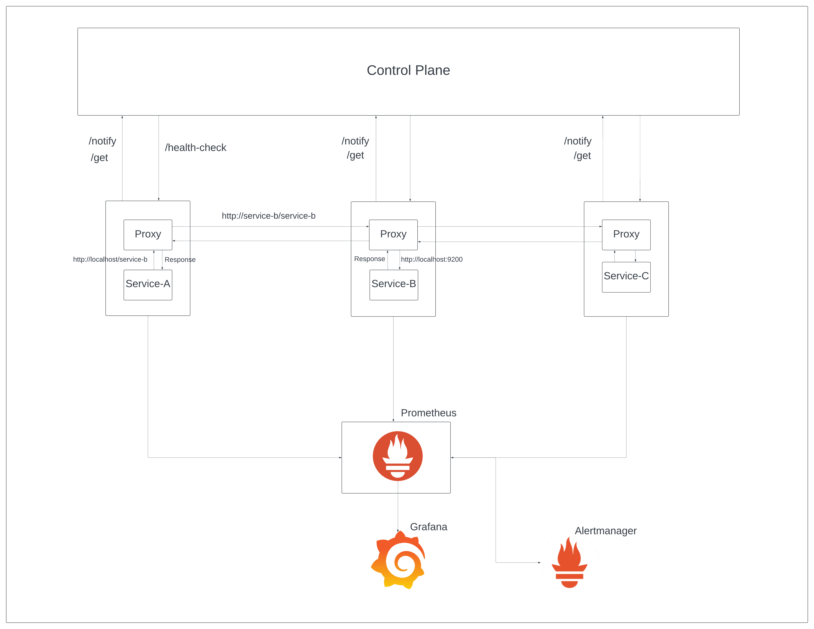
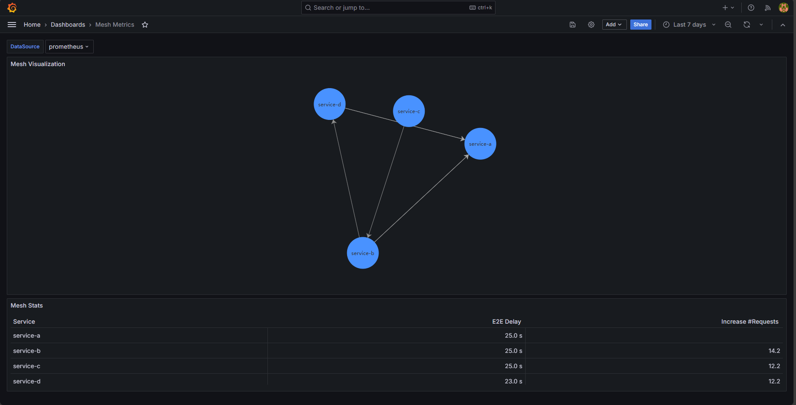
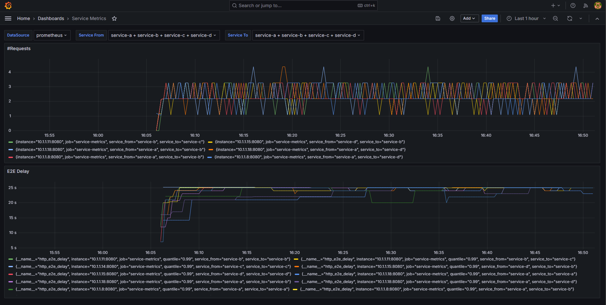

# Service Mesh

## Description
Implemented a service mesh in Golang to enhance the microservices architecture. This project focuses on managing service-to-service communication, providing advanced traffic control, observability, and security features. It leverages lightweight proxies and a control plane to ensure efficient, reliable, and secure interactions between microservices, making it easier to build and maintain complex, distributed systems.

## Table of Contents
- [Introduction](#introduction)
- [Architecture](#architecture)
- [Features](#features)
- [Standard Offerings](#standard-offerings)

## Introduction
Service mesh works on the infrastructure layer in a microservices architecture. The primary task of a service mesh is to decouple the networking logic from the application code, so the application teams just have to focus on the application logic.

## Architecture
The service mesh architecture basically consists of a control plane, which acts as a service registry and controls all the configuration within the mesh. The other part are the data plane also called the service proxies, which are generally deployed as a side car container with search of the service on the mesh. In the general practice, the applications call the endpoints of the other services they want to interact with, but with the side-car proxies the services make a call to the "localhost" which is then intercepted by the proxy and then sent to the designated pod.

### Control Plane
This is responsible for the configuration and management of the proxies in the data plane. It provides APIs for defining policies and configurations, which are then propagated to the proxies.

### Data Plane (Proxy)
This is responsible for handling the actual communication between services. It consists of lightweight proxies (often sidecars) that are deployed alongside each service instance. These proxies intercept and manage all network traffic to and from the service.

## Features
### Networking
- The service mesh takes care of network timeouts, circuit breaking and error handling out-of-the box.
- Helps in identifying and connecting to services dynamically, without the need for hardcoding endpoints.

### Load Balancing
The side-car proxy also provides support for load balancing (round robin) by default, when a request is intercepted by the proxy and if there are multiple designated pods the service mesh redirects the traffic accordingly.

### Monitoring
- As the side-car proxies act as the middlemen in the interaction between two services, we can publish telemetry data regarding like End to End Latency, Number of incoming requests and number of HTTP errors on a service. Then, these metric data is pushed to Prometheus and we provide alerts and visualization over this data.
- Provides out-of-the box visualizations in Grafana, to visualize the connectivity between the different pods and view metrics related to it.

### Security (Future Scope)
- Helps to enforce encryption/decryption of data using mutual TLS.

## Standard Offerings
### Visualizations
The data plane by default publishes some metric data like, End-to-End Delay in a HTTP request, Number of error and incoming request for a particular service.

The Mesh Dashboard can be used to provide a topology of the different services in the mesh and how they interact with one another.

### Alerting (Future Scope)
Our solution leverages the integeration of Alertmanager with Prometheus and puts up alerting of the metrics instrumented by the proxies for each service in the mesh.

